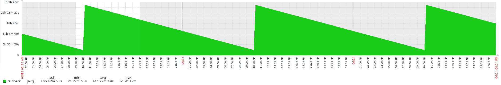
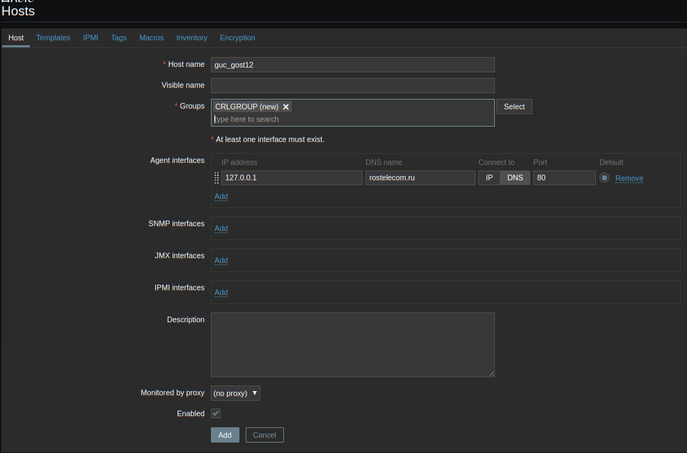
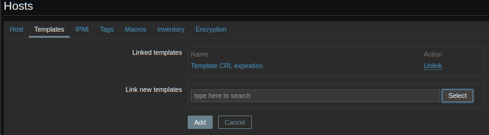
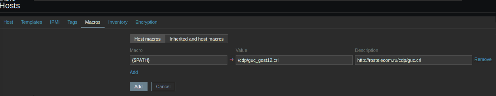
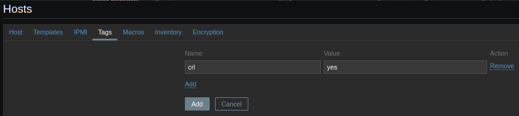

# Zabbix CRL monitor
<h1>
Описание</H1>
Проект содержит шаблон для Zabbix v4.4 и скрипт на Python3, который на основании заданых в Zabbix данных о списке отзыва производит обращение к точке публикации и извлечение информации об оставшемся времени действия, которую он передает обратно в Zabbix.  
Скрипт позволяет проводить проверку списков отзыва только в формате DER. 
Тестировалась работа только со списками отзыва УЦ КриптоПро. Не работает по HTTPS. 
Требуется python3-cryptography. 
<h1>
Установка</H1><ul><li>
Импортируйте шаблон <b><i>zbx_crlmonitor_template.xml</i></b> в свой сервер Zabbix</li><li>
Добавьте узел содержащий описание списка отзыва со следующими обязательными полями: 
Впишите рабочий адрес и <b><i>порт</b></i> в соответствующие поля настроек узла. 
Прикрепите к узлу шаблон  <b><i>Template CRL expiration</b></i>  
Создайте макрос {$PATH} описывающий путь к сертифкату относительно веб-сервера 
Установите узлу тег <b><i>crl</b></i> со значением <b><i>yes</b></i> </li><li>
Установите в заголовке скрипта <b><I>api.py</i></b> параметры доступа к Zabbix, укажите учетную запись имеющую возможность получения данных об узлах при помощи API. Перенесите скрипт на сервер, с которого предполагается производить наблюдение и доступен сервер Zabbix. Обратите внимание, что путь к api_jsonrpc.php, может быть относительно корня или каталога /zabbix/.
Создайте задачу периодического запуска скрипта. Триггер в шаблоне настроен на срабатывание в случае отсутсвия данных более 30 минут.</li></ui>
